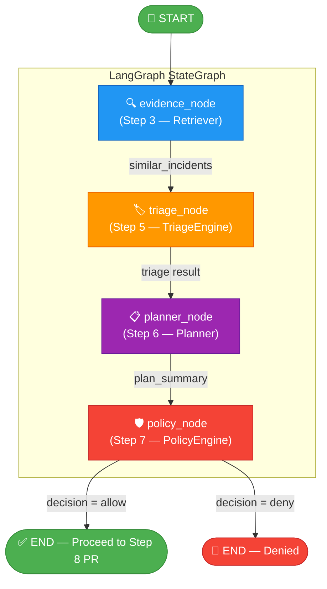
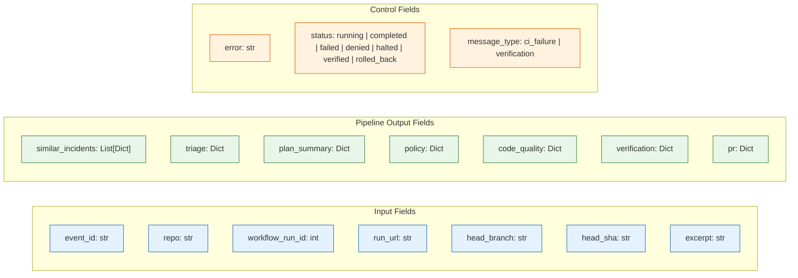

# LangGraph Pipeline — Visual Graph

> **File:** `step4/graph.py` · **State:** `step4/models.py` · **Nodes:** `step4/nodes.py`

---

## Pipeline Flow



---

## Node Details

### Node 1: `evidence_node` (Step 3 — Evidence Retrieval)

| Property | Value |
|----------|-------|
| **Reads** | `state["excerpt"]`, `state["repo"]` |
| **Writes** | `state["similar_incidents"]` |
| **Module** | `step3.retriever.Retriever` |
| **On Failure** | Non-fatal — returns empty list `[]` |

Retrieves similar past CI failures from **Qdrant** vector DB for RAG context.

---

### Node 2: `triage_node` (Step 5 — Failure Classification)

| Property | Value |
|----------|-------|
| **Reads** | `state["excerpt"]`, `state["repo"]`, `state["similar_incidents"]` |
| **Writes** | `state["triage"]` |
| **Module** | `step5.triage.TriageEngine` |
| **On Failure** | Sets `status = "failed"` |

Classifies the CI failure type using **Groq LLM** + past incident context.

---

### Node 3: `planner_node` (Step 6 — Fix Plan Generation)

| Property | Value |
|----------|-------|
| **Reads** | `state["triage"]`, `state["excerpt"]`, `state["repo"]` |
| **Writes** | `state["plan_summary"]` |
| **Module** | `step6.planner.Planner` |
| **On Failure** | Sets `status = "failed"` |

Generates a fix plan and selects the appropriate **playbook**.

---

### Node 4: `policy_node` (Step 7 — Safety Policy)

| Property | Value |
|----------|-------|
| **Reads** | `state["triage"]`, `state["plan_summary"]`, `state["repo"]` |
| **Writes** | `state["policy"]`, `state["status"]` |
| **Module** | `step7.policy.PolicyEngine` |
| **On Failure** | Fail-closed — `decision = "deny"` |

Evaluates safety rules. If **denied**, the pipeline stops (no PR created).

---

## State Schema (`PipelineState`)



---

## Data Flow Summary

```
┌────────────┐     excerpt      ┌────────────┐   similar_incidents   ┌────────────┐
│  Worker    │ ───────────────► │  evidence  │ ─────────────────────► │   triage   │
│ (Step 2)   │                  │  (Step 3)  │                        │  (Step 5)  │
└────────────┘                  └────────────┘                        └─────┬──────┘
                                                                           │ triage
                                                                           ▼
                              ┌────────────┐    plan_summary    ┌────────────┐
                              │   policy   │ ◄───────────────── │  planner   │
                              │  (Step 7)  │                    │  (Step 6)  │
                              └─────┬──────┘                    └────────────┘
                                    │
                         ┌──────────┴──────────┐
                         │                     │
                    allow ▼                    ▼ deny
               ┌────────────┐          ┌────────────┐
               │  Step 9    │          │    STOP     │
               │ Quality    │          │  (denied)   │
               │   Gate     │          └────────────┘
               └─────┬──────┘
                     │
          ┌──────────┴──────────┐
          │                     │
     pass ▼                    ▼ blocked
    ┌────────────┐       ┌────────────┐
    │  Step 8    │       │    STOP    │
    │ PR Creator │       │ (quality)  │
    └─────┬──────┘       └────────────┘
          │
          │ fix/* branch triggers CI re-run
          ▼
    ┌────────────┐
    │  Step 10   │
    │ Verifier   │
    └─────┬──────┘
          │
 ┌────────┴────────┐
 │                 │
 ▼ CI passed       ▼ CI failed
┌──────────┐  ┌──────────────┐
│ verified │  │  Rollback    │
│    ✅    │  │ (revert PR)  │
└──────────┘  └──────────────┘

     Step 11 (Observability) runs throughout:
     ├── Kill switch checked at pipeline start
     ├── Metrics recorded at each step
     └── All metrics pushed to Pushgateway at end
```

---

## Execution Modes

| Mode | When | How |
|------|------|-----|
| **LangGraph** | `langgraph` package installed | `StateGraph.compile().invoke(state)` |
| **Sequential Fallback** | LangGraph missing or fails | `_run_sequential()` calls nodes in order |

Both modes use the **same nodes** and **same state** — identical results.

---

## Entry Point

```python
from step4.graph import run_pipeline

result = run_pipeline(
    event_id="evt-abc123",
    repo="user/mlproject",
    workflow_run_id=12345,
    run_url="https://github.com/user/mlproject/actions/runs/12345",
    excerpt="ModuleNotFoundError: No module named 'pandas'",
)

if result["policy"]["decision"] == "allow":
    # Proceed to Step 8 — PR Creation
    pass
```
